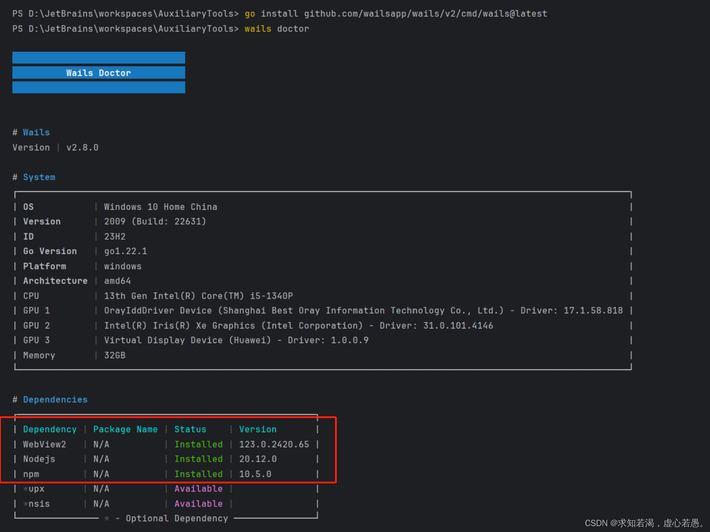
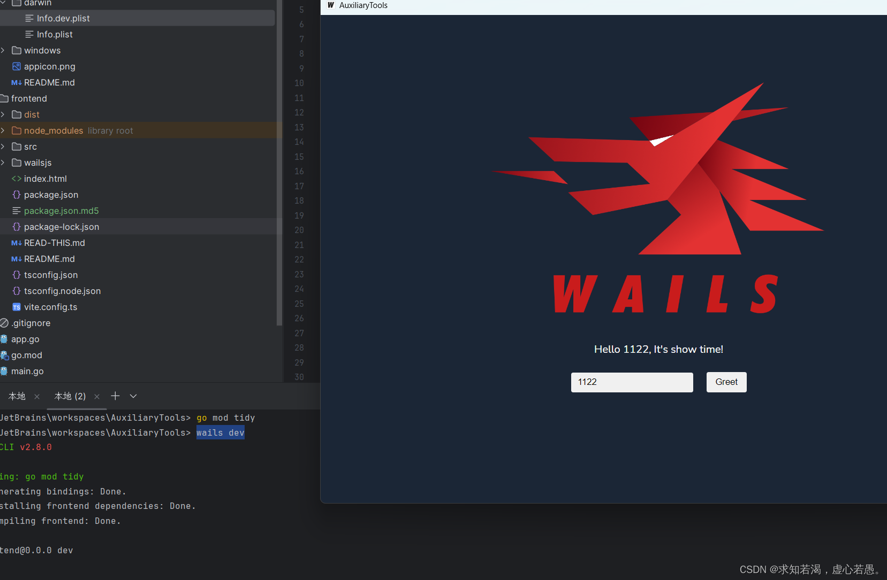

title: 桌面前端技术的造型之-Wails
author: 4color
abbrlink: 53428bbb
tags:
  - Wails
categories:
  - 前端
  - 桌面
date: 2024-10-18 11:00:00
---
# wails是一个可以让go和web技术编写桌面应用

## 安装wails

```shell
go install github.com/wailsapp/wails/v2/cmd/wails@latest
```


## 检查环境

wails doctor



## 创建项目


wails init -n AuxiliaryTools -t vue-ts

拉取go.mod的依赖项
go mod tidy

进入 frontend 前端安装依赖项


npm install /pnpm install

更新源：pnpm config set registry https://registry.npmmirror.com

pnpm up --latest :强制更新

## 启动

wails dev

